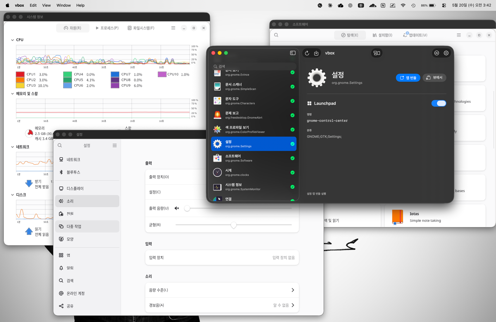

# vbox

[English](./README.md) · [한국어](./README.ko.md) · [日本語](./README.ja.md) · [简体中文](./README.zh.md) · **Español**

Implementación de protocolo propio + compositor anidado Wayland para ejecutar
aplicaciones GUI de invitados Linux en multi-ventana rootless desde un host
macOS. El objetivo es soportar la entrada de teclado en cualquier idioma sin
depender de XPRA.



## ¿Por qué vbox?

- El cliente macOS de XPRA no reenvía la composición IME del host al
  invitado, así que cualquier entrada de teclado no latina (coreano/
  japonés/chino, etc.) se rompe.
- El cask de XPRA para macOS está deprecated — no pasa Gatekeeper y no
  sobrevivirá a futuras versiones de macOS.
- Poseer tanto el formato wire como el cliente es la única manera de
  garantizar el mantenimiento a largo plazo.
- Apuntar a Wayland como backend canónico evita desde el primer día los
  casos especiales de captura/inyección X11.

## Comparación con herramientas similares

| Aspecto | **vbox** | XPRA | VNC | `ssh -X` | Waypipe |
|---|---|---|---|---|---|
| Unidad mostrada | ventanas rootless | ventanas rootless | escritorio completo | una sola ventana | ventanas rootless |
| Pantalla del invitado | Wayland | X11 primero | X11 / Wayland (completo) | X11 | Wayland |
| Cliente macOS | nativo (winit) | cask deprecated | externo (RealVNC, etc.) | XQuartz | ninguno |
| IME asiático (KR/JA/ZH) | sí (text-input-v3) | no (IME del host no se reenvía) | no | no | sí (passthrough Wayland) |
| Transporte | QUIC + TCP / `ssh -L` fallback | TCP / SSH | RFB sobre TCP | SSH X11 | SSH o Unix socket |
| Caso principal | macOS ↔ Linux | cualquiera ↔ cualquiera | cualquiera ↔ cualquiera | cualquiera ↔ cualquiera | Linux ↔ Linux |

## Arquitectura

```
   macOS host                            Linux guest
┌──────────────┐                ┌──────────────────────────────┐
│              │                │  ┌────────────────────────┐  │
│              │  data plane    │  │  vbox-server           │  │
│              │ ◀─QUIC(UDP)──▶ │  │  (data plane)          │  │
│              │   default      │  │  Wayland compositor    │  │
│              │  TCP+ssh -L    │  │  + frame stream        │  │
│  vbox-client │   fallback     │  │  (QUIC + TCP listen)   │  │
│   (viewer)   │                │  └───────────▲────────────┘  │
│              │                │              │ spawns        │
│              │  ctl : 5711    │  ┌───────────┴────────────┐  │
│              │ ◀─token/mTLS─▶ │  │  vbox-controld         │  │
│              │  (bootstrap)   │  │  (control plane)       │  │
│              │                │  │  instance / app RPC    │  │
└──────────────┘                │  └────────────────────────┘  │
                                └──────────────────────────────┘
```

- **vbox-server (invitado)** — *envía la pantalla, recibe la entrada.*
  Corre como compositor Wayland en el invitado Linux. Transmite los
  píxeles de cada ventana al host e inyecta el ratón / teclas / IME del
  host directamente en la app.
  Transporte: QUIC (UDP) preferido; fallback a TCP / `ssh -L` si el UDP
  está bloqueado.
- **vbox-controld (invitado)** — *el manager.*
  Pequeño demonio RPC que arranca vbox-server, lanza / detiene apps y
  entrega al viewer la información de conexión (dirección, token, hash
  del cert QUIC). Autenticación por token o mTLS.
- **vbox-client (macOS)** — *el viewer.*
  Abre una ventana nativa macOS por cada ventana de app del invitado y
  mantiene ratón / scroll / teclas / IME / resize / cierre sincronizados
  con ella. Primero hace bootstrap por controld y luego habla con
  vbox-server directamente.

### Estructura de crates

```
crates/
├── proto/      # formato wire, handshake, tipos RPC (sin I/O)
├── server/     # plano de datos del invitado: vbox-server
├── controld/   # plano de control del invitado: vbox-controld
├── client/     # cliente macOS: vbox-client (ping/view/ctl)
└── vbox-cli/   # CLI clap para usuarios: vbox
```

## Instalación en macOS (Homebrew)

```bash
brew tap openVbox/vbox https://github.com/openVbox/vbox.git
brew install --cask vbox
```

Actualizar / desinstalar:

```bash
brew upgrade --cask vbox
brew uninstall --cask vbox --zap   # también limpia ~/Applications/vbox + ~/.vbox
```

## Instalación en el invitado Linux

```bash
curl -fsSL https://raw.githubusercontent.com/openVbox/vbox/main/scripts/install-linux.sh | sh
```

### Desde la fuente (glibc antigua, otras arquitecturas, o desarrollo)

```bash
# en el invitado — git + cargo + dependencias de build
sudo apt install -y git cargo build-essential pkg-config libxkbcommon-dev   # o equivalente dnf
git clone https://github.com/openVbox/vbox.git ~/vbox && cd ~/vbox
./install.sh   # cargo build → systemd user unit → linger (solo plain-token)
```

## Ejecución

Inicia `vbox.app` desde el Launchpad y elige desde la GUI, o invoca el
CLI directamente:

```bash
# sincronización del invitado + server + túnel ssh + viewer + lanzar app en uno
vbox run gnome-calculator

# por separado
vbox view                    # solo server + túnel + viewer
vbox app gnome-calculator    # lanzar app en un viewer ya abierto

# limpieza
vbox stop
```

Especificar invitado/puerto:

```bash
vbox --guest USER@HOST --guest-dir /path/to/vbox --port 5710 run gnome-calculator
```

## Changelog

Ver [CHANGELOG.md](./CHANGELOG.md).
